# Network Latency and Packet Loss Chaos Emulator

A Linux-based network chaos emulator developed using **C/C++**, a **Linux character device driver**, **IOCTL communication**, and the Linux **`tc netem`** networking subsystem.

The project provides a controlled environment for simulating selected network conditions such as **latency, jitter, and packet loss**, along with basic **TCP and UDP socket testing**.

---

## Features

- Latency / Delay Simulation
- Jitter Simulation
- Packet Loss Simulation
- Predefined Network Profiles
- TCP Socket Testing
- UDP Socket Testing
- Linux Character Device Driver
- IOCTL-based Configuration
- `tc netem` Network Configuration
- Linux-based Network Testing Environment

---

## Project Objective

The objective of this project is to develop a Linux-based experimental environment for simulating selected network conditions and testing network communication.

The system combines:

- A **C++ user-space control application**
- A **Linux character device driver**
- **IOCTL communication**
- The Linux **`tc netem`** networking subsystem
- TCP and UDP socket-based test programs

The Linux device driver receives and stores the selected network configuration through IOCTL communication. The C++ application uses the selected profile and applies the corresponding network conditions through `tc netem`.

---

## System Architecture

<p align="center">
  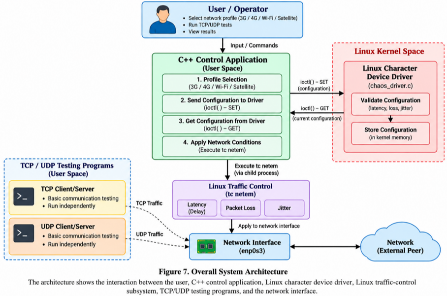
</p>

---
## Project Workflow

The project follows the workflow below:

1. Build the Linux character device driver.
2. Load the driver into the Linux kernel.
3. Create and verify the `/dev/chaos_driver` device.
4. Start the C++ control application.
5. Select a predefined network profile.
6. Send the selected configuration to the driver using IOCTL.
7. Retrieve and verify the stored configuration.
8. Apply latency, jitter, and packet loss using `tc netem`.
9. Verify the applied network configuration using `tc qdisc`.
10. Run TCP or UDP socket tests.
11. Remove the network impairment after testing.

---

## Network Profiles

The project uses predefined **project-defined simulation parameters**.

| Profile | Latency | Jitter | Packet Loss |
|---|---:|---:|---:|
| 3G | 100 ms | 30 ms | 2% |
| 4G | 50 ms | 15 ms | 1% |
| Wi-Fi | 20 ms | 5 ms | 1% |
| Satellite | 600 ms | 50 ms | 2% |

> **Note:** These values are project-defined simulation parameters and are not measurements of real-world network conditions.

### Latency

<p align="center">
  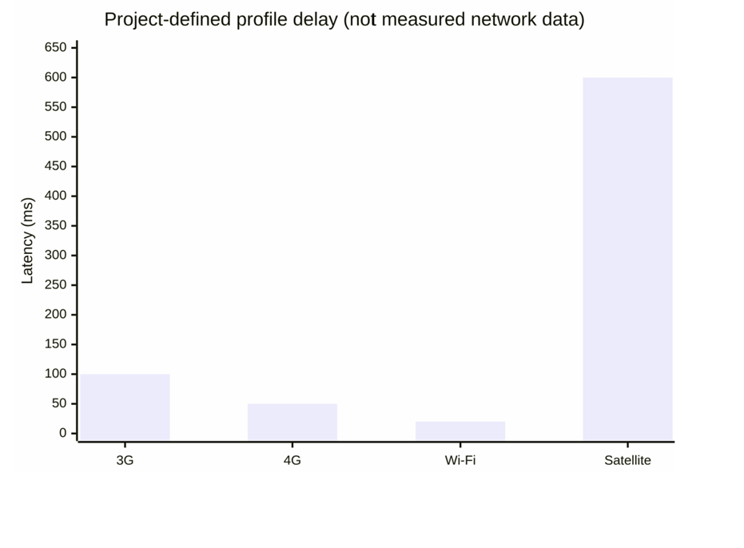
</p>

### Packet Loss

<p align="center">
  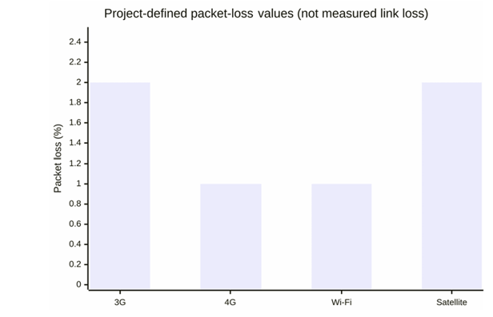
</p>

### Jitter

<p align="center">
  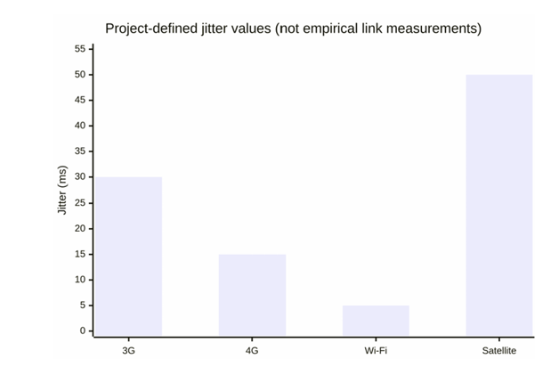
</p>

---
## Project Structure

```text
Network-Latency-Packet-Loss-Chaos-Emulator/
│
├── driver/
│   ├── chaos_driver.c
│   └── Makefile
│
├── src/
│   └── main.cpp
│
├── tests/
│   ├── driver_ioctl_test.cpp
│   ├── tcp_test.cpp
│   └── udp_test.cpp
│
├── docs/
│   ├── Stage1/
│   ├── Stage2/
│   ├── Stage3/
│   ├── Stage4/
│   ├── Stage5/
│   ├── Stage6/
│   └── images/
│
├── CMakeLists.txt
├── README.md
└── .gitignore
```

---

## Technologies Used

- **C**
- **C++**
- **Linux Kernel Module**
- **Linux Character Device Driver**
- **IOCTL**
- **TCP Sockets**
- **UDP Sockets**
- **`tc netem`**
- **Linux `iproute2`**
- **GCC / G++**
- **Make**
- **CMake**
- **Git**
- **Ubuntu Linux**

---

## Requirements

The project requires:

- Ubuntu Linux
- GCC / G++
- Linux kernel headers
- Make
- CMake
- Git
- `iproute2` / `tc`

The Linux kernel headers should match the currently running kernel version.

---
# Build and Execution

## 1. Build the Linux Device Driver

From the project root:

```bash
make -C /lib/modules/$(uname -r)/build M=$(pwd)/driver modules
```

---

## 2. Load the Driver

Load the kernel module:

```bash
sudo insmod driver/chaos_driver.ko
```

Verify that the device file was created:

```bash
ls -l /dev/chaos_driver
```

The expected device file is:

```text
/dev/chaos_driver
```

---

## 3. Build the Main Application

Compile the C++ control application:

```bash
g++ -Wall -Wextra src/main.cpp -o chaos_emulator
```

---

## 4. Run the Main Application

Start the application:

```bash
sudo ./chaos_emulator
```

The application allows the user to select one of the predefined network profiles:

- 3G
- 4G
- Wi-Fi
- Satellite

---
# Driver IOCTL Test

The IOCTL test verifies communication between the user-space test program and the Linux character device driver.

## Compile

```bash
g++ tests/driver_ioctl_test.cpp -o tests/driver_ioctl_test
```

## Run

```bash
sudo ./tests/driver_ioctl_test
```

The test:

1. Sends a network configuration to the driver.
2. Retrieves the stored configuration.
3. Displays the values received from the driver.

This verifies the basic **IOCTL SET/GET communication**.

---

# TCP Testing

Compile the TCP test program:

```bash
g++ -Wall -Wextra tests/tcp_test.cpp -o tests/tcp_test
```

## Start TCP Server

```bash
./tests/tcp_test server
```

## Start TCP Client

In another terminal:

```bash
./tests/tcp_test client 127.0.0.1
```

The client sends a message to the TCP server and receives a response while measuring the local round-trip time.

---
# UDP Testing

Compile the UDP test program:

```bash
g++ -Wall -Wextra tests/udp_test.cpp -o tests/udp_test
```

## Start UDP Server

```bash
./tests/udp_test server
```

## Start UDP Client

In another terminal:

```bash
./tests/udp_test client 127.0.0.1
```

The UDP client sends a packet to the server and receives a response.

---

# Network Configuration Verification

The currently applied `tc netem` configuration can be checked using:

```bash
sudo tc qdisc show dev enp0s3
```

This allows verification of the configured:

- Delay
- Jitter
- Packet loss

After testing, remove the network impairment configuration using:

```bash
sudo tc qdisc del dev enp0s3 root
```

---

# Project Demonstration

The repository contains screenshots documenting the major stages of implementation and testing.

## Linux Environment

Environment and system information screenshots are stored in:

```text
docs/images/01_environment/
```

## System Architecture

Architecture and design diagrams are stored in:

```text
docs/images/02_architecture/
```

The architecture documentation includes:

- Overall System Architecture
- UML / Structural View
- Operational State Machine
- Initial Implementation Flow
- Development Timeline

---
## Linux Device Driver

### Device File

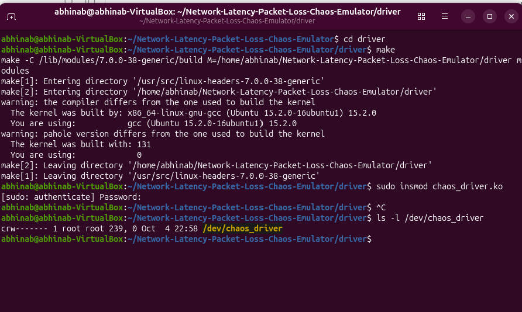

### Driver Loaded

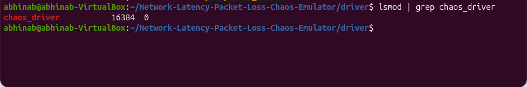

---

## IOCTL Communication

### IOCTL SET/GET Configuration

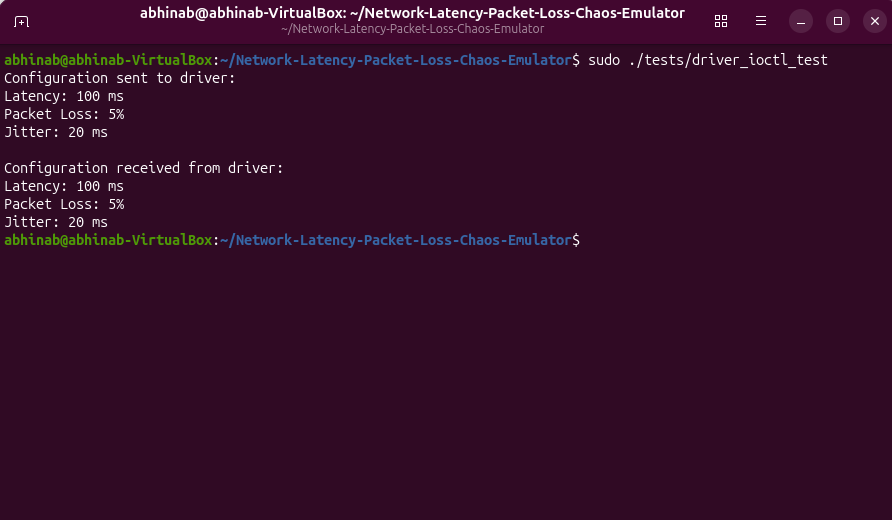

---

## C++ Control Application

### Main Application

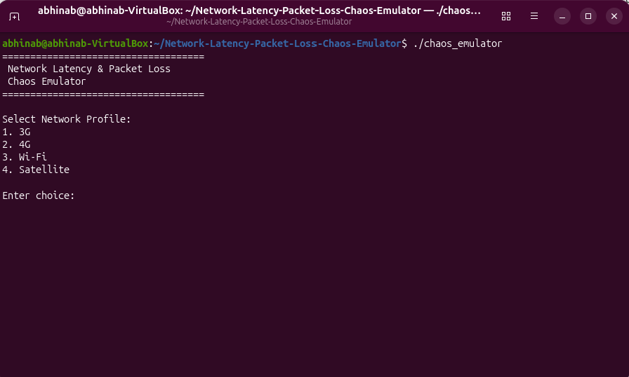

### 3G Network Profile

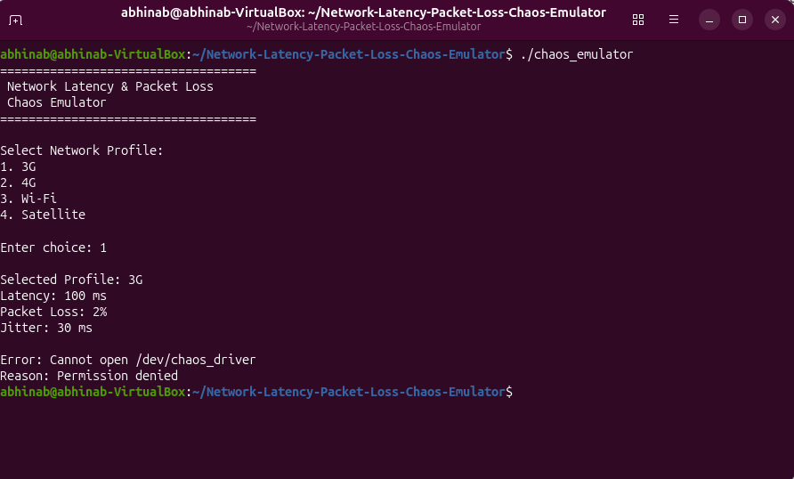

---

## `tc netem` Verification

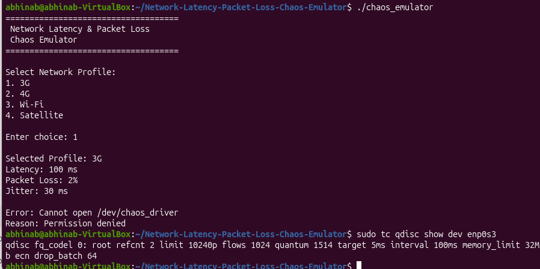

---

## TCP Testing

### TCP Server

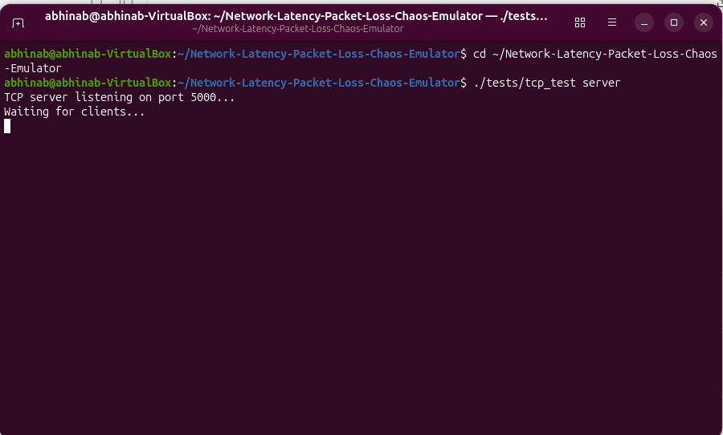

### TCP Client

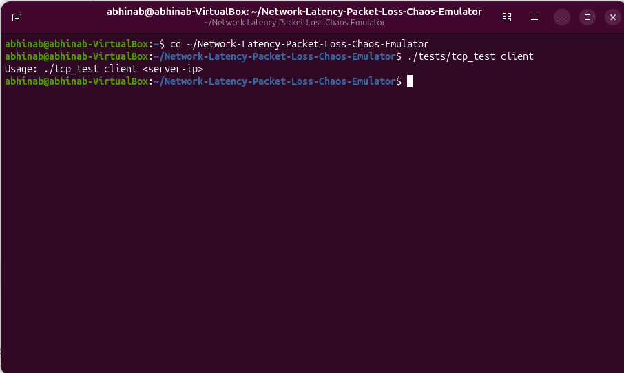

---

## UDP Testing

### UDP Server

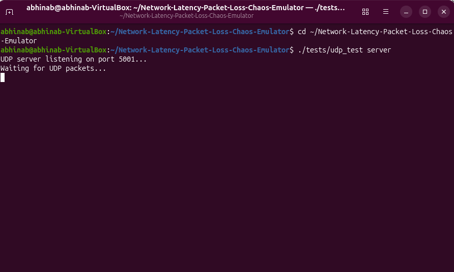

### UDP Client

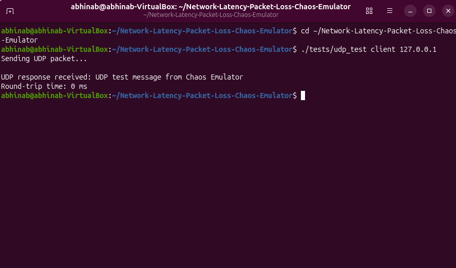

### UDP Server Handling

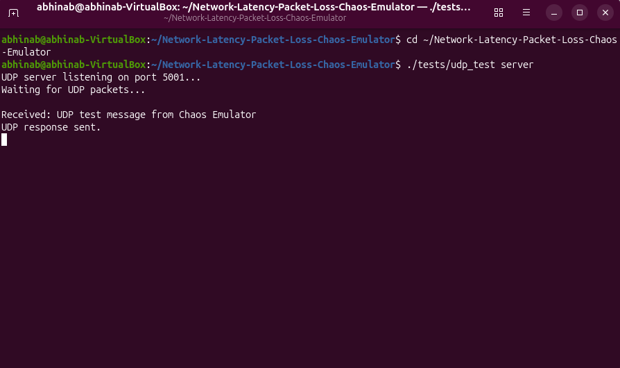

---

## Network Profile Visualization

The repository contains project-defined visualizations for:

- Latency
- Packet Loss
- Jitter

These charts represent the **configured simulation parameters**, not measured real-world network performance.

The visualizations are stored in:

```text
docs/images/09_profiles/
```

---
# Testing Status

The following components were tested during development:

- Linux Character Device Driver
- Device File Creation
- Driver Loading
- C++ Driver Communication
- IOCTL SET Configuration
- IOCTL GET Configuration
- Latency / Delay Configuration
- Packet Loss Configuration
- Jitter Configuration
- 3G Profile
- 4G Profile
- Wi-Fi Profile
- Satellite Profile
- TCP Socket Testing
- UDP Socket Testing
- `tc netem` Integration
- Network Configuration Verification

The four **project-defined network profiles** were applied and verified using `tc netem` on the `enp0s3` interface.

---

# Testing Limitation

The TCP and UDP functional tests were performed using endpoints within the same Ubuntu virtual machine.

The local test traffic was routed through the Linux loopback interface:

```text
127.0.0.1
```

which corresponds to the:

```text
lo
```

interface rather than `enp0s3`.

Therefore, the TCP and UDP tests demonstrate successful socket communication, but their local round-trip measurements do **not** demonstrate the effect of `tc netem` applied to `enp0s3`.

Complete end-to-end validation of network impairment effects on TCP and UDP traffic would require a separate network endpoint or a test setup where the traffic passes through the impaired interface.

---
# Documentation

The project documentation is divided into six development stages:

### Stage 1 — Project Introduction

Introduction, problem statement, objectives and project scope.

### Stage 2 — Requirements and Development Plan

Functional requirements, non-functional requirements and development planning.

### Stage 3 — System Design and Architecture

System architecture, design diagrams and component interactions.

### Stage 4 — Initial Implementation and Prototype

Initial implementation of the driver, C++ application and testing components.

### Stage 5 — Testing, Integration and Improvement

Testing, integration and verification of the implemented components.

### Stage 6 — Final Implementation and Presentation

Final implementation, results, documentation and project presentation.

All stage documentation is available inside the `docs/` directory.

---

# Git Version Control

Git was used throughout the development process to maintain the project source code and documentation.

The repository contains:

- Source code
- Linux driver code
- Test programs
- Documentation
- Build configuration
- Project screenshots
- Project structure

Development was maintained through incremental Git commits during the different project stages.

---

# Cleanup

After testing, remove the network impairment:

```bash
sudo tc qdisc del dev enp0s3 root
```

To unload the Linux device driver:

```bash
sudo rmmod chaos_driver
```

---

# Project Status

The **Network Latency and Packet Loss Chaos Emulator** has reached a functional prototype suitable for academic demonstration.

The project demonstrates practical concepts in:

- Linux system programming
- Linux device drivers
- C and C++ programming
- IOCTL communication
- TCP socket programming
- UDP socket programming
- Linux network configuration
- Network condition simulation using `tc netem`

The project provides a foundation for further development and more comprehensive end-to-end network impairment testing.

---

# Author

**Abhinab Kumar Das**

B.Tech — Computer Science and Engineering (IoT)

Siksha 'O' Anusandhan University

---

# License

This project was developed for academic and educational purposes.
